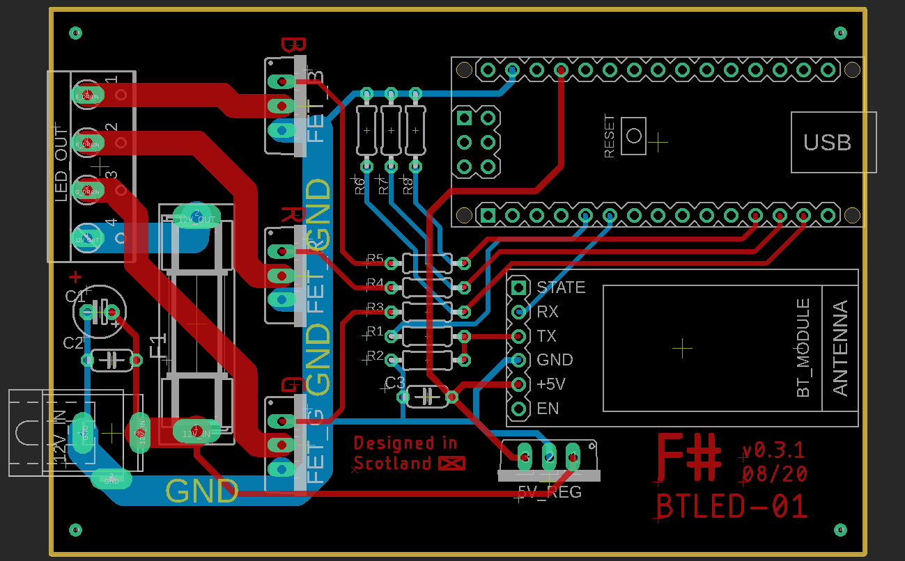
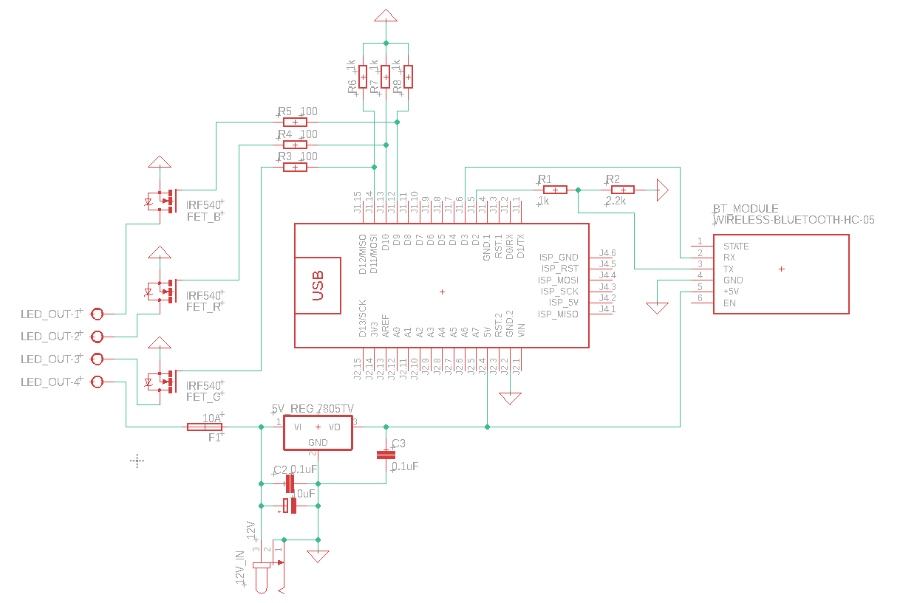

# BTLED-01
## Bluetooth-enabled RGB LED driver

An open-hardware PWM driver board for 12V RGB LEDS, specifically 5050 LED strip.

Features an onboard Arduino Nano and HC-05 Bluetooth module for control.

Designed to handle up to 6A current draw, roughly equivalent to 100 5050 LEDs at full brightness on all channels.

Project files are for [Autodesk EAGLE](https://www.autodesk.com/products/eagle/overview).

### Parts list:
 - 1x Arduino Nano
 - 1x HC-05 Bluetooth Module
 - 3x TO-220 N-channel power MOSFETs, rated >2A
 - 1x TO-220 5V linear regulator
 - 2x 0.1µF ceramic capacitor
 - 1x 10µf electrolytic capacitor
 - 3x 100Ω resistor
 - 4x 1kΩ resistor
 - 1x 2.2kΩ resistor
 - 1x 20mm fuse holder & 13A fuse
 - 1x 4-channel 3.5mm pitch screw terminal
 - 1x 5.5x2.5mm DC jack connector

### Board design

### Schematic

